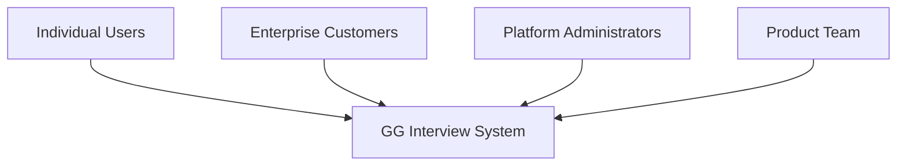
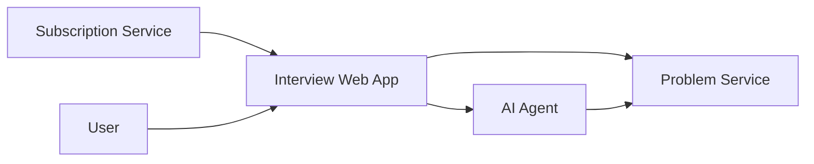
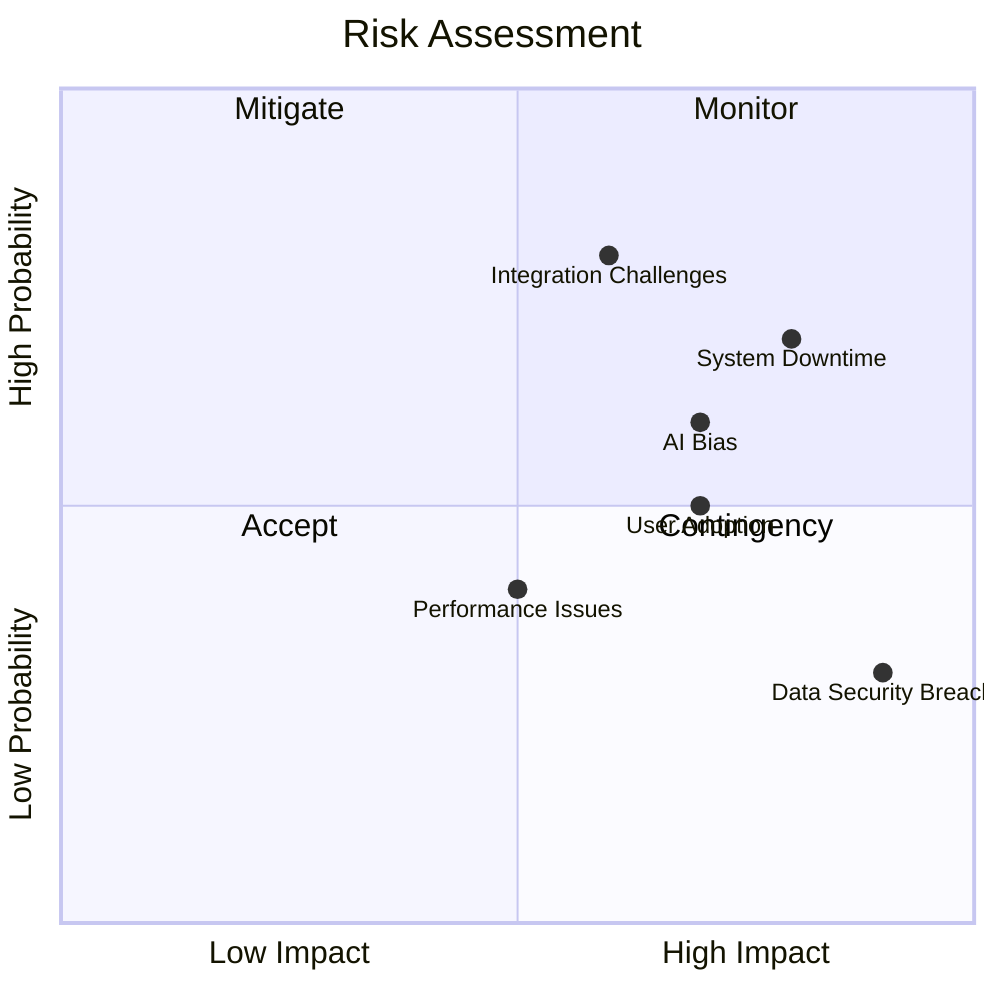
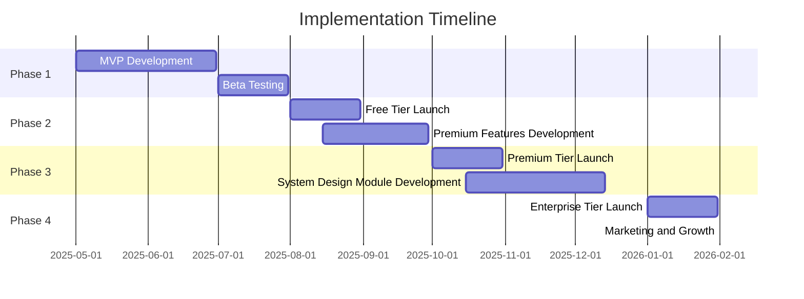

# Business Requirements Document (BRD)

## Executive Summary

This Business Requirements Document (BRD) outlines the business needs and objectives for the GG Interview System - a SaaS platform offering AI-powered technical interview practice for software engineers preparing for job interviews.

The system consists of three main components:
1. An AI agent service that simulates an interviewer and evaluates solutions
2. A web application interface for conducting realistic interview practice
3. A problem service that provides a library of interview questions and challenges

## Business Objectives

The primary business objectives of the GG Interview System are to:

1. Generate recurring revenue through tiered subscription plans
2. Provide software engineers with realistic technical interview practice
3. Offer premium content like system design interview simulations as upsell opportunities
4. Scale the user base while maintaining high-quality AI interactions
5. Establish the platform as a leading technical interview preparation tool

## Stakeholders

Key stakeholders include:
- **Individual Users**: Software engineers preparing for technical interviews
- **Enterprise Customers**: Companies purchasing bulk licenses for employees/candidates
- **Platform Administrators**: Technical team maintaining the SaaS platform
- **Product Team**: Responsible for feature development and subscription tiers

## Market Assessment

The technical interview preparation market has several established players, but many solutions lack:
- Realistic AI-powered interview simulations
- High-quality system design interview practice
- Personalized feedback on both technical and communication skills
- Continuously updated problem libraries reflecting current industry questions

The GG Interview System addresses these gaps by providing:
- AI-powered interview simulations with audio/video interaction
- Premium system design interview modules
- Tiered subscription plans for different needs and budgets
- LeetCode-integrated problem library with AI-generated solutions

## Product/Solution Overview

The GG Interview System provides:

1. **Interview Simulation**: A web application with audio/video capabilities for realistic interviews
2. **Problem Repository**: LeetCode-integrated service providing coding challenges
3. **AI Interviewer**: Gemini-powered agent that conducts interviews and provides feedback
4. **Subscription Management**: Tiered plans with different feature access levels
5. **User Dashboard**: Progress tracking and performance analytics for users

## Functional Requirements

### Free Tier Features
- Limited access to coding problem library
- Basic AI interviewer interaction
- Text-only feedback on solutions
- Support for 2 programming languages

### Premium Subscription Features
- Full access to coding problem library
- Advanced AI interview simulation with audio/video
- Detailed solution analysis and feedback
- Support for 10+ programming languages
- Performance analytics and progress tracking

### Enterprise Tier Features
- Team management and progress tracking
- Custom problem sets and interview scenarios
- System design interview modules
- Advanced analytics and reporting
- Bulk licensing and user management

## Non-Functional Requirements

### Performance and Scalability
- Support for 100+ concurrent interviews
- Response time < 2 seconds for most operations
- AI analysis completion within 30 seconds
- 99.9% uptime during business hours

### Security and Compliance
- SOC 2 compliance for data security
- GDPR and CCPA compliance for candidate data
- Role-based access controls
- Secure data encryption for all communications

### User Experience
- Intuitive, modern UI design
- Accessibility compliance (WCAG 2.1 AA)
- Mobile-responsive interface
- Support for major browsers (Chrome, Firefox, Safari, Edge)

## Constraints and Assumptions

### Constraints
- Integration with existing HR systems
- Compliance with company security policies
- Budget and timeline limitations
- Technology stack compatibility with existing systems

### Assumptions
- Internet connectivity for all users
- Basic technical proficiency of interviewers
- Availability of technical documentation for integration
- Support from IT for implementation and maintenance

## Success Criteria

The GG Interview System will be considered successful if it:

1. Achieves significant subscriber growth within 12 months of launch
2. Maintains high monthly retention rate for premium subscribers
3. Converts a substantial percentage of free tier users to paid subscriptions
4. Achieves 90%+ user satisfaction rating for interview realism
5. Establishes sustainable recurring revenue streams

## Risk Assessment

Major risks include:
- **System Downtime**: Mitigated through redundant systems and monitoring
- **Data Security**: Addressed through encryption and access controls
- **AI Bias**: Reduced through diverse training data and regular audits
- **Integration Challenges**: Managed with phased implementation approach
- **User Adoption**: Supported with comprehensive training and intuitive design

## Timeline and Implementation Phases

## Conclusion

The GG Interview System represents a significant opportunity in the technical interview preparation market through its innovative AI-powered interview simulations, tiered subscription model, and premium content offerings. By implementing this SaaS platform, the company can establish a scalable revenue stream while helping software engineers worldwide prepare for technical interviews with realistic practice and personalized feedback.

## Approval

| Stakeholder | Name | Signature | Date |
|-------------|------|-----------|------|
| Product Owner | | | |
| Engineering Lead | | | |
| CEO | | | |
| Marketing Director | | | |
