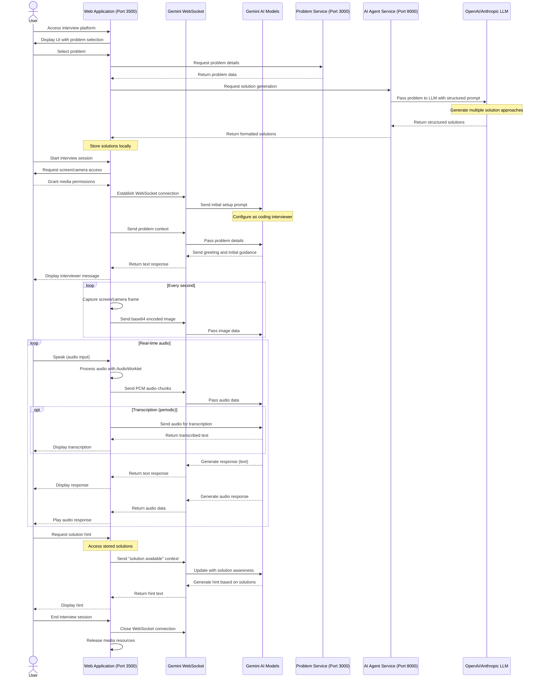
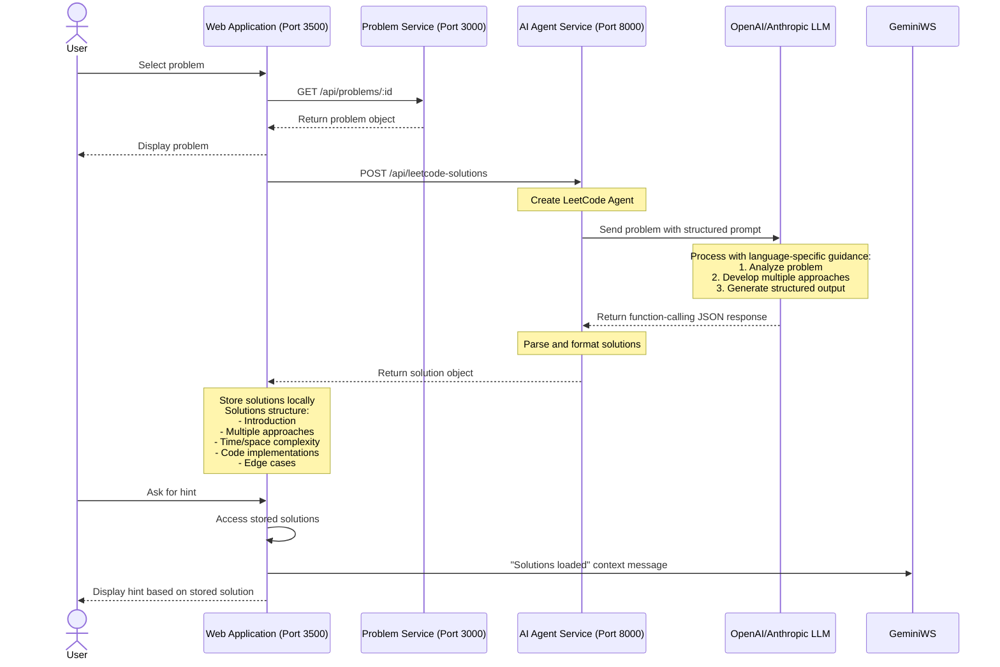
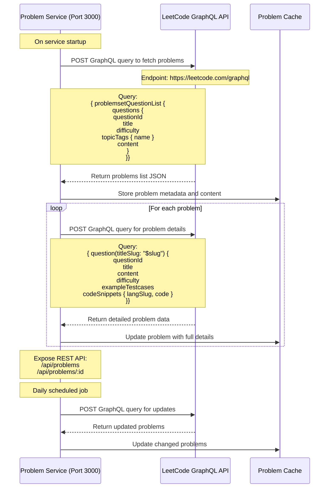
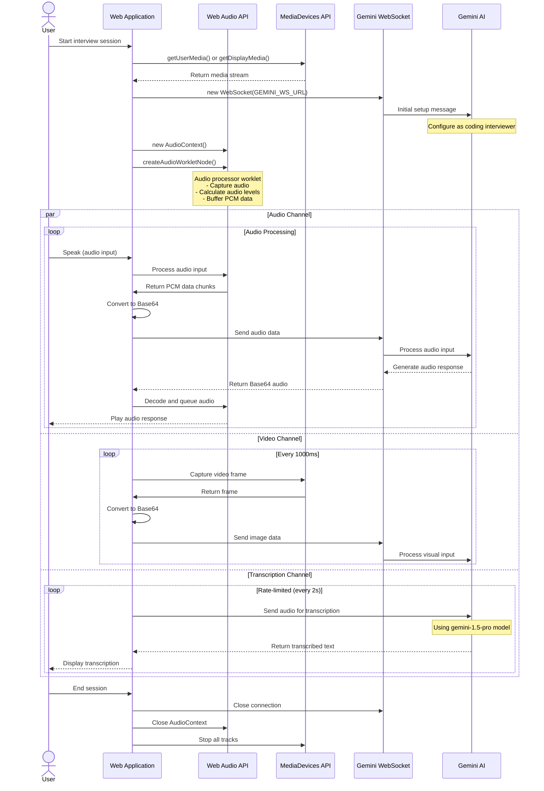

# Enhanced System Sequence Diagrams

## Complete User Flow with LLMs and Media Integration

## Problem and Solution Flow Details

## LeetCode GraphQL Integration Flow

## Real-time WebSocket and Media Communication

