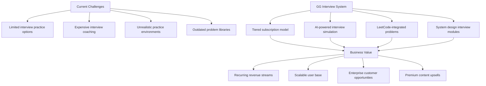
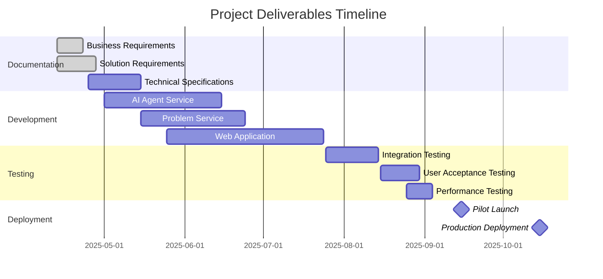
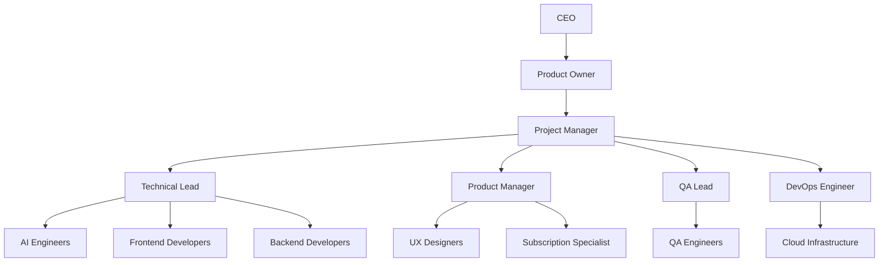
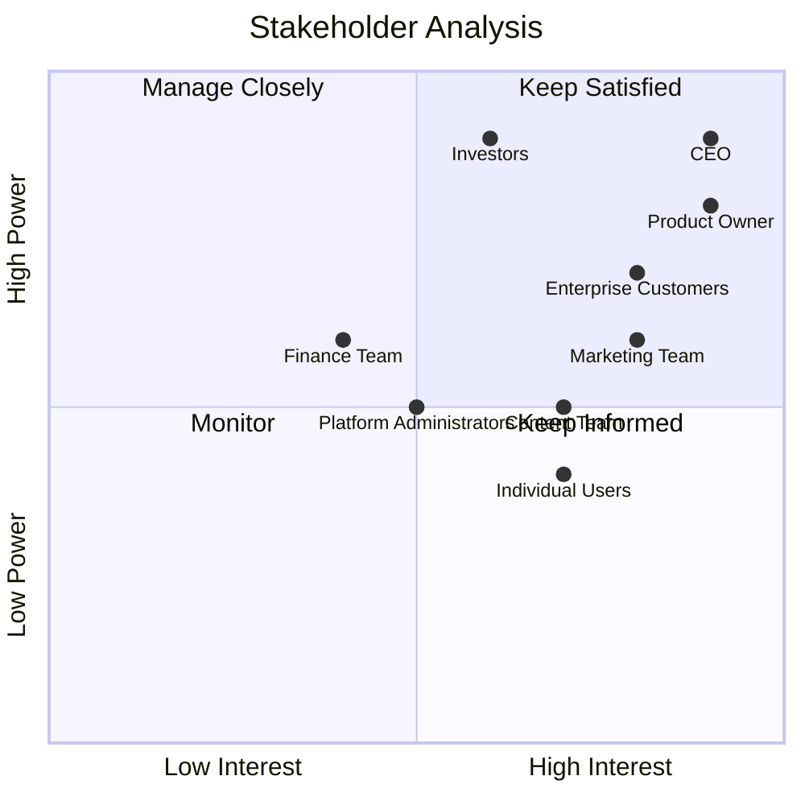
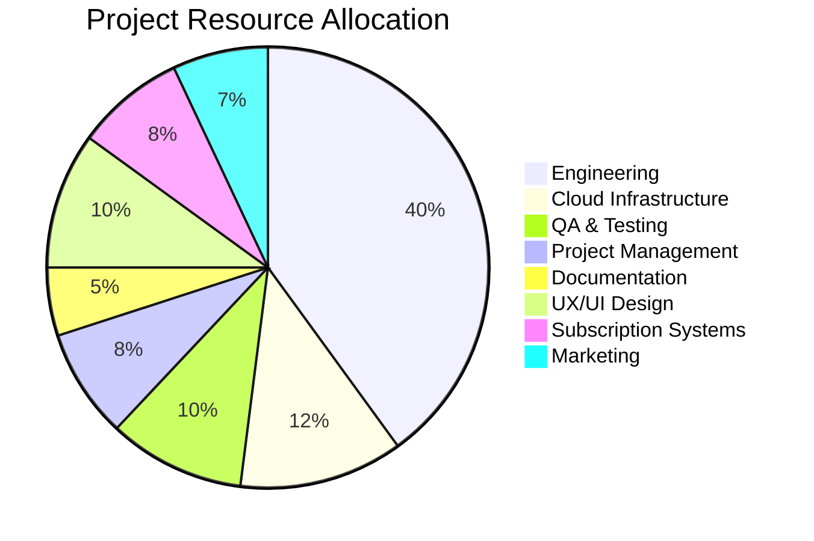
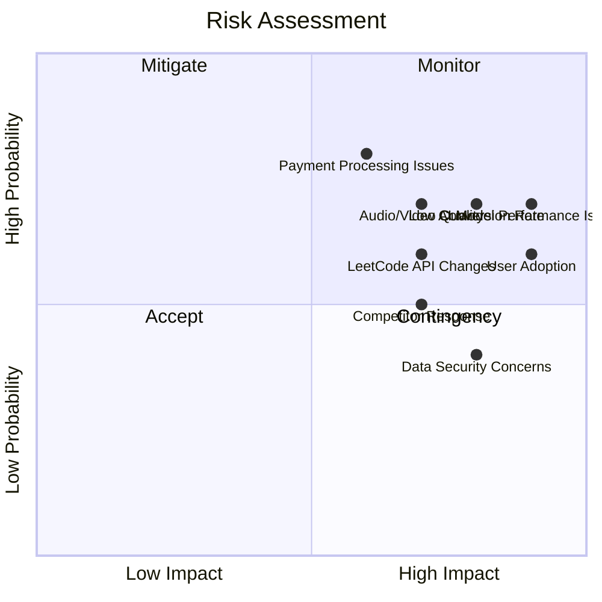
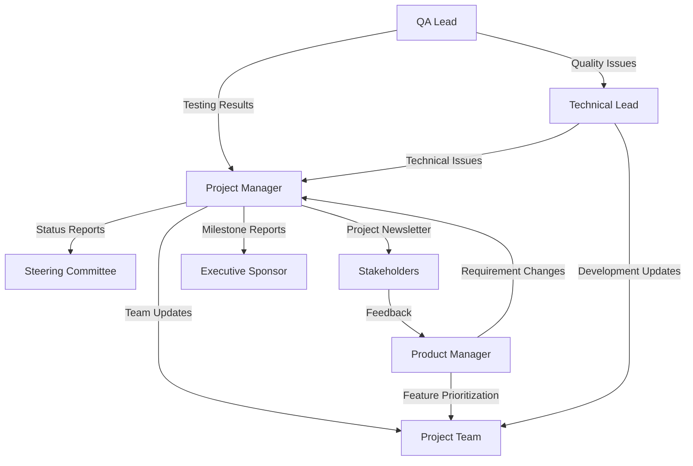

# Project Charter

## Project Overview

**Project Name**: GG Interview System  
**Date**: April 13, 2025  
**Project Manager**: [Project Manager Name]  
**Executive Sponsor**: [Executive Sponsor Name]

## Project Description

The GG Interview System is a SaaS platform offering AI-powered technical interview practice for software engineers preparing for job interviews. The system comprises three core components:

1. **AI Agent Service**: Python-based system running on port 8000 that simulates an interviewer and evaluates solutions
2. **Web Application**: Next.js application running on port 3500 that provides realistic interview practice with audio/video capabilities
3. **Problem Service**: Node.js service running on port 3000 that integrates with LeetCode's GraphQL API to maintain an updated problem library

This innovative solution will be monetized through tiered subscription plans, from a free basic tier to premium offerings including system design interview modules.

## Business Case

### Business Drivers
- Growing demand for technical interview preparation resources
- Limited availability of realistic interview practice environments
- Engineers seeking affordable alternatives to expensive coaching
- Need for up-to-date practice with current industry problems

### Quantifiable Benefits
- **Recurring Revenue**: Predictable monthly subscription income
- **Scalability**: Global reach with minimal marginal cost per user
- **Upsell Opportunities**: Premium features and specialized content modules
- **Enterprise Potential**: Bulk licensing for companies and bootcamps

### Project Investment Areas
- Initial platform development
- Content creation and problem integration
- AI model training and tuning
- Marketing and user acquisition

### Return Timeline
- Monthly recurring revenue starting from launch
- Scaling with user base growth over time

## Project Objectives and Success Criteria

### Primary Objectives

| Objective | Description | Success Criteria | Measurement Method |
|-----------|-------------|------------------|-------------------|
| Launch Subscription Platform | Create tiered subscription service | Fully functional free, premium and enterprise tiers | Feature completion audit |
| Grow User Base | Attract and retain subscribers | Significant growth in active users | User analytics |
| Convert Free Users | Move users to paid subscriptions | Substantial free-to-paid conversion rate | Subscription analytics |
| Create Premium Content | Develop system design modules | Complete system design interview simulations | Content completion metrics |
| Establish Market Position | Build brand in interview prep space | Positive user reviews and word-of-mouth growth | Review monitoring and referral tracking |

### Project Deliverables

## Project Scope

### In Scope
- Development of all three core components (AI Agent, Web App, Problem Service)
- Web-based interview practice platform with subscription management
- Integration with LeetCode GraphQL API for problem data
- Real-time audio/video interview simulation with Gemini AI
- Multiple subscription tiers with feature differentiation
- User progress tracking and performance analytics
- Payment processing and subscription management

### Out of Scope
- Career coaching and resume services
- Non-technical interview preparation
- Job placement services
- Recruiting or talent marketplace features
- Custom enterprise problem creation tools (first version)
- Support for non-coding assessments

## Project Organization

### Roles and Responsibilities

| Role | Responsibilities | Allocated To |
|------|------------------|-------------|
| CEO | Strategic vision, funding approval, investor relations | [Name] |
| Product Owner | Product roadmap, market fit, subscription strategy | [Name] |
| Project Manager | Overall project delivery, milestone tracking, risk mitigation | [Name] |
| Technical Lead | Architecture decisions, technical direction, code quality | [Name] |
| Product Manager | Feature prioritization, user experience, pricing tiers | [Name] |
| AI Engineers | Development of AI interviewer components | [Team Members] |
| Frontend Developers | Web application and subscription UI development | [Team Members] |
| Backend Developers | Problem service and API development | [Team Members] |
| QA Team | Testing strategy, test execution, quality assurance | [Team Members] |
| Subscription Specialist | Subscription infrastructure, payment processing | [Team Members] |

## Stakeholder Analysis

## Project Milestones

| Milestone | Description | Target Date |
|-----------|-------------|-------------|
| Project Kickoff | Official start of project activities | May 1, 2025 |
| Requirements Finalized | Complete and approved requirements | May 15, 2025 |
| Architecture Design Approved | Technical architecture signoff | May 30, 2025 |
| MVP Development Complete | Core functionality implemented | July 15, 2025 |
| Beta Testing Complete | Feedback from initial testers integrated | July 31, 2025 |
| Free Tier Launch | Public launch of free subscription tier | August 15, 2025 |
| Premium Tier Launch | Launch of paid subscription features | October 1, 2025 |
| System Design Module Launch | Release of premium interview content | December 1, 2025 |
| Enterprise Tier Launch | Launch of team and organization features | January 15, 2026 |

## Budget Summary

| Category | Allocation Percentage |
|----------|-----------|
| Engineering | 40% |
| Cloud Infrastructure | 12% |
| QA & Testing | 10% |
| Project Management | 8% |
| Documentation | 5% |
| UX/UI Design | 10% |
| Subscription Systems | 8% |
| Marketing | 7% |
| **Total** | **100%** |

## Risk Assessment and Management

### Risk Matrix

### Top Risks and Mitigation Strategies

| Risk | Probability | Impact | Mitigation Strategy | Owner |
|------|------------|--------|---------------------|-------|
| AI Model Performance Issues | High | High | Regular model tuning, robust fallback options | AI Team Lead |
| Low Conversion Rate | High | High | Compelling premium features, A/B testing, user feedback | Product Manager |
| Payment Processing Issues | Medium | High | Multiple payment providers, thorough testing | Subscription Specialist |
| User Adoption | High | Medium | Free tier value, smooth onboarding, content marketing | Marketing Lead |
| LeetCode API Changes | Medium | High | API monitoring, fallback problem repository | Backend Lead |

## Communication Plan

### Key Communications

| Communication | Audience | Frequency | Method | Owner |
|---------------|----------|-----------|--------|-------|
| Project Status Report | Steering Committee | Weekly | Meeting + Report | Project Manager |
| Development Update | Project Team | Daily | Stand-up | Technical Lead |
| Stakeholder Update | All Stakeholders | Bi-weekly | Email Newsletter | Project Manager |
| Technical Review | Engineering Team | Weekly | Meeting | Technical Lead |
| Executive Summary | C-Level | Monthly | Presentation | Executive Sponsor |
| User Testing Feedback | Project Team | As Available | Dashboard + Report | QA Lead |

### Communication Matrix

## Quality Management Approach

### Quality Objectives
- Zero critical defects in subscription functionality
- 95% test coverage for core functionality
- High accuracy in AI interview simulations
- 99.9% system availability for paying subscribers
- Fast response time for all subscription tiers

### Quality Assurance Activities
- Automated unit and integration testing
- Regular code reviews and static analysis
- Subscription flow testing with various payment methods
- Security vulnerability scanning
- Beta user testing with real interview scenarios
- Audio/video quality testing across different devices

## Training and Knowledge Transfer

### Training Plan
- Developer onboarding for system architecture and components
- Customer support training for subscription management
- User guides for different subscription tiers
- Tutorial videos for new subscribers

### Knowledge Transfer
- Comprehensive system documentation
- Subscriber FAQ and help resources
- Knowledge base for common technical issues
- Content creation guidelines for system design modules

## Approval

This Project Charter has been reviewed and approved by the following stakeholders:

| Role | Name | Signature | Date |
|------|------|-----------|------|
| CEO | | | |
| Product Owner | | | |
| Technical Lead | | | |
| Marketing Director | | | |

## Revision History

| Version | Date | Description | Author | Approver |
|---------|------|-------------|--------|----------|
| 0.1 | 2025-04-13 | Initial draft | [Name] | - |
| 1.0 | 2025-04-20 | Approved version | [Name] | [Name] |
