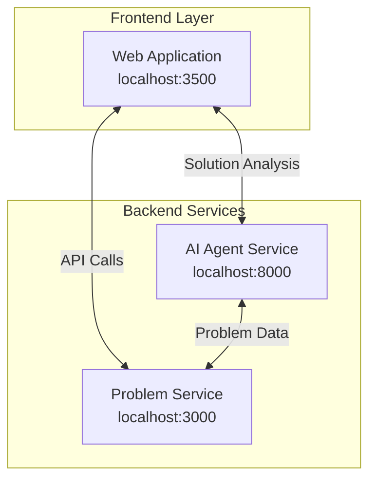
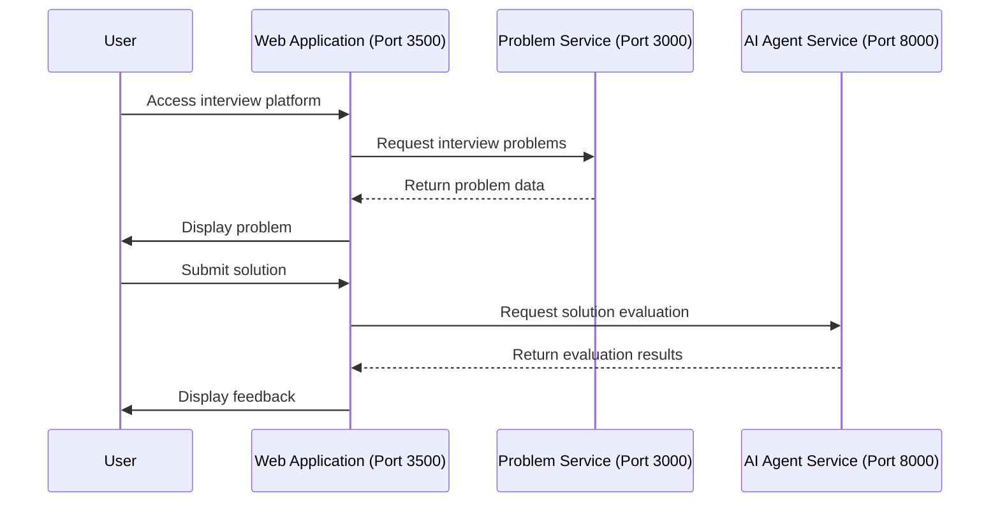
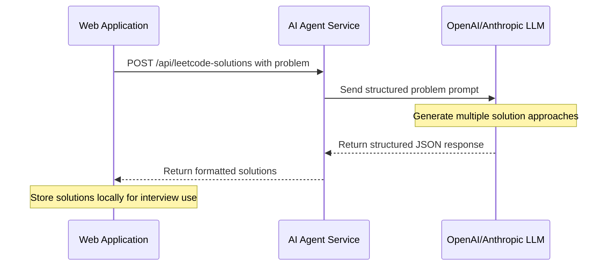
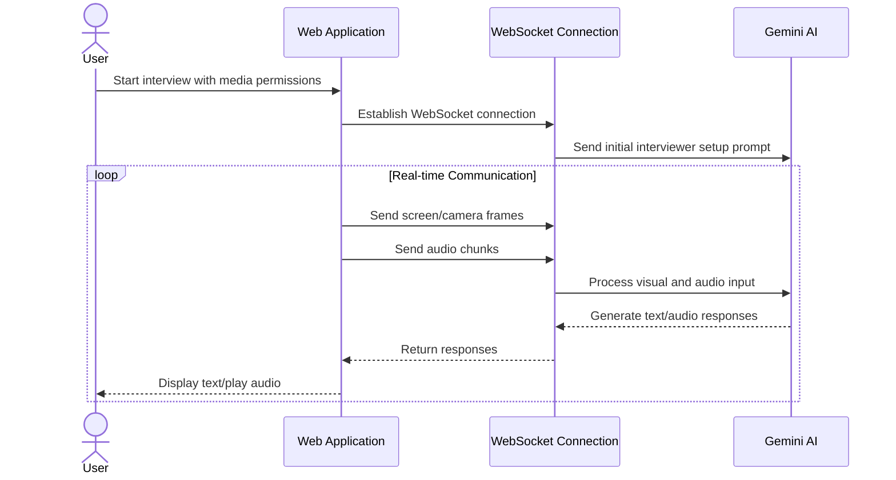
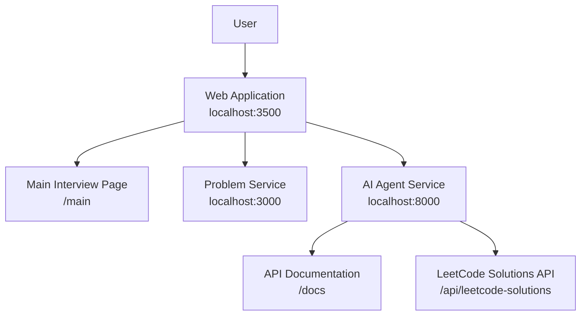
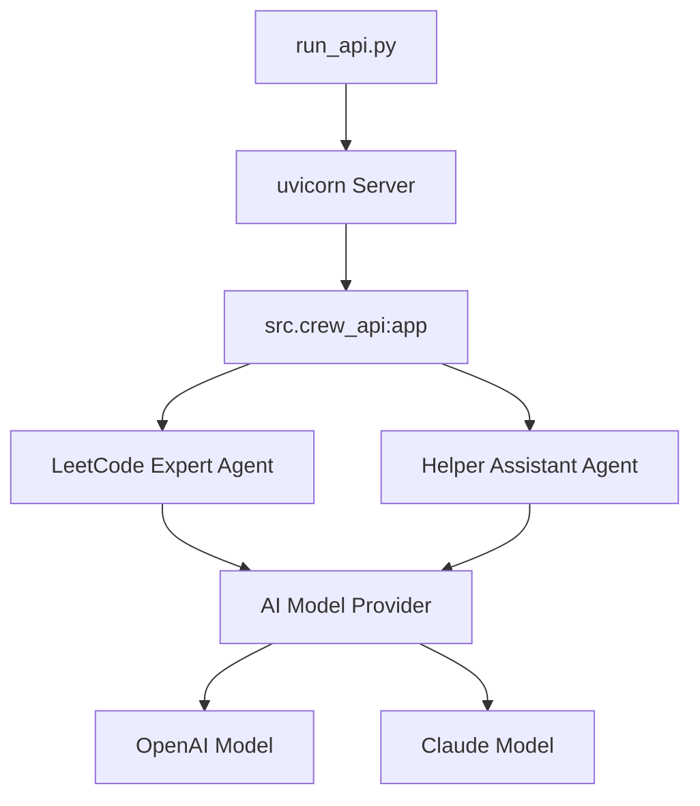
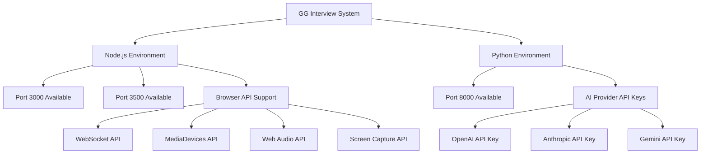

# Software Requirements Specification (SRS)

## 1. Introduction

### 1.1 Purpose
This Software Requirements Specification (SRS) document describes the functional and non-functional requirements for the GG Interview System. The system is designed to provide an AI-powered technical interview platform with three primary components.

### 1.2 System Overview
The GG Interview System consists of three main components that work together:

1. An AI agent service running on port 8000 (Python-based)
2. A web application interface running on port 3500 (Next.js-based) 
3. A problem service running on port 3000

### 1.3 Document Conventions
This document uses the following conventions:
- **Must/Shall** - Mandatory requirements
- **Should** - Recommended but not mandatory
- **May/Can** - Optional requirements

### 1.4 Intended Audience
This document is intended for developers, QA engineers, and system administrators responsible for implementing, testing, and maintaining the GG Interview System.

## 2. System Architecture

### 2.1 System Components



The GG Interview System architecture consists of three primary components:

1. **Interview Web Application (Next.js)**: A user interface running on port 3500, with the main functionality accessible at `/main`
2. **Problem Service**: A service running on port 3000 that provides interview problems
3. **AI Agent Service (Python)**: A LLM-powered service running on port 8000, implemented in the `run_api.py` file

### 2.2 Technology Stack

Based on project analysis, the technology stack includes:

#### Client-side
- Next.js 15.1.7
- React 19.0.0
- Tailwind CSS 3.4.1
- Radix UI components
- MermaidJS 11.6.0
- GoJS 3.0.21

#### Server-side
- Node.js for the Problem Service
- Python for the AI Agent Service
- Uvicorn for serving the AI Agent API

## 3. Functional Requirements

### 3.1 Web Application

#### FR-WA-01: User Interface
The web application shall provide a user interface accessible at port 3500.

#### FR-WA-02: Main Interview Interface
The system shall provide the main interview functionality at the `/main` route.

#### FR-WA-03: AI Service Integration
The web application shall communicate with the AI Agent Service for solution analysis.

#### FR-WA-04: Problem Service Integration
The web application shall retrieve problems from the Problem Service.

#### FR-WA-05: Screen Sharing
The web application shall enable screen sharing capability to send visual information to Gemini AI via WebSocket.

#### FR-WA-06: Real-time Audio Communication
The web application shall capture, process, and transmit audio data to Gemini AI and play audio responses in real-time.

#### FR-WA-07: Video Communication
The web application shall support both camera video and screen sharing modes for visual communication with Gemini AI.

### 3.2 Problem Service

#### FR-PS-01: Problem Provision
The Problem Service shall provide interview problems to the web application.

#### FR-PS-02: Service Availability
The Problem Service shall be accessible on port 3000.

### 3.3 AI Agent Service

#### FR-AI-01: Solution Evaluation
The AI Agent Service shall evaluate solutions submitted through the `/api/leetcode-solutions` endpoint.

#### FR-AI-02: Model Provider Support
The AI Agent Service shall support multiple AI model providers:
- Claude-3-7-Sonnet from Anthropic
- o3-mini-2025-01-31 from OpenAI

#### FR-AI-03: Specialized Agent Roles
The AI Agent Service shall implement a "crew" approach with specialized agents including:
- LeetCode Expert
- Helper Assistant

#### FR-AI-04: API Documentation
The AI Agent Service shall provide API documentation at the `/docs` endpoint.

#### FR-AI-05: Server Configuration
The AI Agent Service shall run on port 8000 using Uvicorn as the ASGI server.

## 4. System Interactions

### 4.1 User Flow Sequence

A detailed sequence diagram showing the complete flow of the system is available in the [Enhanced System Sequence Diagrams](./enhanced-sequence-diagram.md) document. Below is a simplified overview:



### 4.2 Solution Fetching Flow

The solution fetching process integrates LLM processing to generate solution approaches:



### 4.3 Real-time Communication Flow

The real-time interview uses WebSocket for bidirectional communication with Gemini AI:



### 4.4 Component Dependencies



## 5. External Interfaces

### 5.1 API Endpoints

#### 5.1.1 AI Agent API

| Endpoint | Method | Description |
|----------|--------|-------------|
| `/api/leetcode-solutions` | POST | Primary endpoint for the LeetCode crew API |
| `/docs` | GET | API documentation provided by FastAPI |

### 5.2 User Interfaces

#### 5.2.1 Web Application

| Interface | URL | Description |
|-----------|-----|-------------|
| Main Interview Page | http://localhost:3500/main | Primary interface for interview functionality |

### 5.3 WebSocket Communication

#### 5.3.1 Gemini WebSocket

| WebSocket Endpoint | Description |
|--------------------|-------------|
| `wss://generativelanguage.googleapis.com/ws/google.ai.generativelanguage.v1alpha.GenerativeService.BidiGenerateContent` | WebSocket endpoint for real-time communication with Gemini AI |

#### 5.3.2 WebSocket Message Types

| Message Type | Direction | Content |
|--------------|-----------|----------|
| Text Messages | Client → Server | Interview questions, commands, and context |
| Audio Chunks | Client → Server | Base64-encoded PCM audio data |
| Image Frames | Client → Server | Base64-encoded image data |
| Text Responses | Server → Client | Gemini AI text responses |
| Audio Responses | Server → Client | Base64-encoded audio responses |

## 6. Non-functional Requirements

### 6.1 Configuration Requirements

#### NFR-CONF-01: API Key Management
The AI Agent service shall require API keys for model providers:
- `OPENAI_API_KEY` for OpenAI model usage
- `ANTHROPIC_API_KEY` for Claude model usage

#### NFR-CONF-02: Environment Variables
The system shall load environment variables from a `.env` file if available.

### 6.2 Security Requirements

#### NFR-SEC-01: API Key Security
API keys shall be securely stored in environment variables and not hardcoded in the codebase.

### 6.3 Performance Requirements

#### NFR-PERF-01: Service Availability
All services shall be available on their respective ports:
- Web Application: Port 3500
- Problem Service: Port 3000
- AI Agent Service: Port 8000

## 7. AI Agent Details

### 7.1 AI Model Integration

#### 7.1.1 AI Agent Service Models
The AI Agent supports two model providers that can be configured via environment variables:

##### 7.1.1.1 OpenAI Integration
When configured to use OpenAI, the system shall:
- Use the o3-mini-2025-01-31 model
- Require a valid OPENAI_API_KEY in environment variables

##### 7.1.1.2 Anthropic Integration
When configured to use Anthropic, the system shall:
- Use the Claude-3-7-Sonnet model
- Require a valid ANTHROPIC_API_KEY in environment variables

#### 7.1.2 Web Application AI Integration

##### 7.1.2.1 Gemini Models
The web application integrates with Google's Gemini AI via WebSocket:
- Uses `models/gemini-2.0-flash-exp` for real-time interview communication
- Uses `gemini-1.5-pro` for audio transcription
- Uses `gemini-1.5-flash-8b` for additional text processing
- Requires NEXT_PUBLIC_GEMINI_API_KEY environment variable

### 7.2 AI Agent Architecture



## 8. Implementation Requirements

### 8.1 Development Environment

#### 8.1.1 Web Application
From the package.json, the following development environment configurations are required:

```json
"scripts": {
  "dev": "rm -rf .next && NEXT_SKIP_APP_BUNDLE=true next dev --turbopack -p 3500",
  "build": "rm -rf .next && NEXT_SKIP_APP_BUNDLE=true next build",
  "start": "next start -p 3500",
  "lint": "next lint",
  "clear-cache": "rm -rf .next"
}
```

#### 8.1.2 AI Agent Service
From run_api.py, the service is started using:

```python
uvicorn.run(
    "src.crew_api:app",
    host=args.host,
    port=args.port,
    reload=args.reload
)
```

## 9. System Requirements

### 9.1 Operational Requirements



The system requires:
1. Available ports: 3000, 3500, and 8000
2. Appropriate environment setup for Node.js and Python
3. Valid API keys for OpenAI, Anthropic, and/or Gemini
4. Modern browser with support for:
   - WebSocket API for real-time communication
   - MediaDevices API for camera and microphone access
   - Web Audio API for audio processing
   - Screen Capture API for screen sharing

## 10. Testing Requirements

### 10.1 Component Testing

#### 10.1.1 Web Application Testing
The web application shall be tested for:
- UI rendering
- API integration with Problem Service
- API integration with AI Agent Service

#### 10.1.2 AI Agent Testing
The AI Agent shall be tested for:
- API functionality
- Model provider integration
- Response quality

#### 10.1.3 Problem Service Testing
The Problem Service shall be tested for:
- Problem retrieval
- API functionality
- Integration with Web Application

## 11. Audio and Video Processing

### 11.1 Audio Processing

#### 11.1.1 Audio Capture and Processing
The system shall capture and process audio using the following techniques:
- Use Web Audio API's AudioContext and AudioWorkletNode
- Process audio at 24,000 Hz sample rate
- Convert PCM audio data to WAV format for transmission
- Transmit audio chunks in real-time via WebSocket

#### 11.1.2 Audio Playback
The system shall handle AI-generated audio responses:
- Decode Base64-encoded audio responses
- Create AudioBufferSourceNode for playback
- Queue audio segments for continuous playback
- Provide audio level visualization

#### 11.1.3 Transcription
The system shall transcribe user audio:
- Use Gemini AI for speech-to-text processing
- Rate-limit transcription requests (max 1 per 2 seconds)
- Skip audio chunks shorter than minimum threshold
- Pause transcription during critical operations

### 11.2 Video Processing

#### 11.2.1 Camera Capture
The system shall support camera video capture:
- Use MediaDevices API to access user camera
- Render video stream to HTML video element
- Capture frames at regular intervals (1 per second)

#### 11.2.2 Screen Sharing
The system shall support screen sharing:
- Use getDisplayMedia() API to capture screen
- Allow user to select which screen/window to share
- Send screen captures to Gemini AI via WebSocket
- Handle screen sharing session termination

## 12. WebSocket Communication Protocol

### 12.1 Client-Server Communication
The system implements a bidirectional communication protocol with Gemini AI:
- Establish secure WebSocket connection
- Send initial setup messages with interview context
- Stream audio, video, and text data in real-time
- Receive and process AI responses

### 12.2 Session Management
The system manages WebSocket sessions:
- Generate unique identifiers for each session
- Handle connection errors and reconnection
- Implement graceful disconnection
- Manage state transitions between problems

## 13. LLM Prompt Templates and Use Cases

### 13.1 Web Application Prompts (Gemini AI)

#### 13.1.1 Initial Setup Prompt

```
You are an **expert coding interviewer** conducting a live coding session. 
Please greet the candidate warmly as soon as possible, and don't wait for them to speak first.

You are an **expert coding interviewer** conducting a live coding session. 
Initially, you don't know which problem the candidate will work on, so don't assume any specific problem. 
You can see the candidate's screen as they code, and your primary role is to provide guidance and encouragement. 
Your approach should be supportive and educational, helping them understand the requirements better. 
Regularly ask them about their thought process with questions like 'Why did you choose this approach?' 
or 'Have you considered these edge cases?' to deepen their understanding. 
When you see them implementing a solution, inquire about their reasoning to help them articulate their thoughts. 
Be supportive, offer timely hints, and create a positive learning environment. 
If a new problem is selected, completely forget any previous problems and focus only on the current one.
```

**Use Case**: This prompt is sent during the initial WebSocket connection setup in `sendInitialSetup()` method of the `GeminiWebSocket` class. It establishes the role of Gemini AI as a coding interviewer and sets the general behavior guidelines.

#### 13.1.2 Welcome Message Prompt

```
Please greet the candidate warmly as soon as possible, and don't wait for them to speak first.
You should ask them to open their code editor, and until you see their code editor open, you should say let get started.
```

**Use Case**: Sent immediately after the initial setup to prompt Gemini to greet the user and initiate the interview session.

#### 13.1.3 Problem Context Prompt

```
IMPORTANT: Forget any previous problems. A new problem has been selected:

**Title**: [Problem Title]

**Problem Description**:
[Problem Description]

As an expert interviewer:
1. Actively guide the candidate with encouragement and support.
2. Ask questions about their approach to help them understand the requirements better.
3. Inquire about why they chose specific implementations to deepen their understanding.
4. Help them identify edge cases and potential optimizations.
5. Monitor their code as they work, offering timely and constructive guidance.

Your goal is to create a supportive environment while helping them improve their problem-solving skills.
```

**Use Case**: This prompt is sent in the `sendNewProblemContext()` method when a new problem is selected. It provides Gemini with the problem title and description and reinforces the interviewer role guidelines.

#### 13.1.4 Solution Context Prompt

```
Solutions loaded for "[Problem Title]" ([Number] solutions). Don't mention or discuss solutions unless candidate explicitly asks for a hint.
```

**Use Case**: Sent in the `sendSolutionContext()` method when solutions are loaded for a problem. This instructs Gemini to be aware of solutions but not to mention them unless explicitly asked for hints.

#### 13.1.5 Transcription Prompt

```
Transcribe this audio:
```

**Use Case**: Used in the `transcribeAudio()` method of the `TranscriptionService` class when sending audio data to Gemini for transcription.

### 13.2 AI Agent Prompts (OpenAI/Anthropic)

#### 13.2.1 LeetCode Agent Role Prompt

```
You are an expert in algorithms and data structures with years of experience solving complex programming problems. You specialize in analyzing problems thoroughly, identifying optimal approaches, and implementing clean, efficient solutions with proper explanations of your thought process and complexity analysis.
```

**Use Case**: Used in the `_create_agent()` method of the `LeetCodeAgent` class to define the agent's role and expertise.

#### 13.2.2 Problem Solving Task Prompt

```
Solve the following LeetCode problem using [language]:

[problem_description]

Provide multiple solution approaches with detailed explanations, code implementation, and complexity analysis.
```

**Use Case**: Used in the `create_leetcode_task()` method of the `AgentCrew` class to create a task for solving LeetCode problems.

#### 13.2.3 OpenAI Function Calling Prompt

The AI agent uses a structured output format defined by the following Pydantic models:

```python
class Approach:
    """A single approach to solving a LeetCode problem"""
    rank: int  # Rank/order of the approach (1 is best)
    title: str  # Title of the approach
    description: str  # Detailed explanation of the approach
    time_complexity: str  # Time complexity analysis
    space_complexity: str  # Space complexity analysis
    code: str  # Code implementation of the approach
    edge_cases: str  # Discussion of edge cases
    test_examples: str  # Example test cases

class LeetCodeSolution:
    """Complete solution to a LeetCode problem with multiple approaches"""
    introduction: str  # Overview of the problem and approaches
    approaches: List[Approach]  # List of solution approaches
```

**Use Case**: Used in the `solve_problem()` method of the `LeetCodeAgent` class to generate structured solution responses via OpenAI function calling.

#### 13.2.4 Language-Specific Guidance Prompts

**Python:**
```
Use Python's built-in functions and standard libraries where appropriate. Aim for Pythonic code that is both efficient and readable.
```

**Java:**
```
Follow Java conventions and utilize appropriate data structures from Java Collections Framework. Consider both readability and performance.
```

**Use Case**: Added to the system message in the `solve_problem()` method of the `LeetCodeAgent` class based on the selected programming language.

## 14. Conclusion

This Software Requirements Specification document outlines the requirements for the GG Interview System based on the observed project structure and code. The system consists of three main services that work together to provide an interview platform:

1. **Web Application**: A Next.js-based interface running on port 3500 that implements real-time screen sharing, audio/video communication with Gemini AI via WebSocket
2. **Problem Service**: A service running on port 3000 that provides interview problems
3. **AI Agent Service**: A Python-based service running on port 8000 that evaluates solutions using AI models

The system supports integration with OpenAI, Anthropic, and Google Gemini AI models, configured through environment variables.

## 15. Appendices

### 15.1 Glossary

| Term | Definition |
|------|------------|
| AI Agent | The Python-based service that evaluates code submissions using AI models |
| Problem Service | The service running on port 3000 that provides interview problems |
| Web Application | The Next.js application running on port 3500 that serves as the user interface |
| LeetCode Crew | The specialized AI agents working together to analyze solutions |
| WebSocket | Bidirectional communication protocol for real-time data exchange |
| Screen Sharing | Feature allowing users to share their screen content with Gemini AI |
| PCM | Pulse-Code Modulation, a method used to digitally represent sampled analog signals |
| AudioWorklet | Web Audio API interface for audio processing |
| MediaDevices | Web API providing access to connected media input devices |

### 15.2 References

1. Web Application package.json - Dependencies and scripts configuration
2. AI Agent run_api.py - Server configuration and initialization
3. Project Directory Structure - Component organization and relationships
4. geminiWebSocket.ts - WebSocket implementation for Gemini communication
5. CameraPreview.tsx - Screen sharing and audio/video capture implementation
6. transcriptionService.ts - Audio transcription service implementation
7. audioUtils.ts - Audio processing utilities
